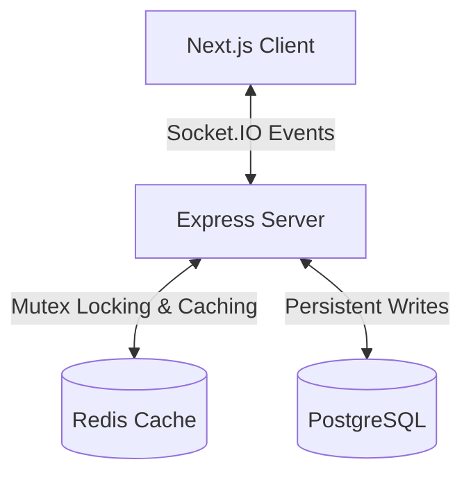

# NexusGrid - Real-time Collaborative Board

NexusGrid is a premium, highly interactive real-time strategy board where every cell (out of a 10,000 virtualized grid) is a distributed object featuring optimistic locking, live synchronization, presence cursor tracking, area control regions, combo systems, and timeline history replays.

Think of it as **r/place** + **Figma multiplayer** + **Notion collaboration** + **Git version history**.

---

## System Architecture



### Flow of a Tile Capture Event
1. **Client Action**: User clicks tile `x,y`.
2. **Optimistic UI Update**: The client immediately claims the tile locally, colors it, starts the 5-second cooldown indicator, and runs click ripple particles.
3. **Socket Event**: Client emits `capture` event to the backend.
4. **Server locking**: 
   - Backend acquires an atomic Redis Mutex Lock for key `lock:x,y`.
   - Backend checks if the tile is in cooldown.
   - Backend checks if the user is rate-limited (max 1 capture request per 350ms).
5. **Database Transaction**:
   - If checks pass, updates tile owner in PostgreSQL.
   - Records historical trace in `History` log.
   - Updates capturing user's score based on adjacency combo multiplier.
6. **Broadcasting**:
   - Updates the main Redis grid cache state (`grid:tiles`).
   - Releases the Redis Lock.
   - Broadcasts `capture_success` to all sockets.
   - Broadcasts updated live leaderboard rankings.
7. **Rollback (Conflict Scenario)**: If checks fail (e.g. concurrent race condition won by another socket), server emits `capture_failed`. Clicking client rolls back local state to original owner and flashes a red shake overlay.

---

## Tech Stack & Rationale

* **Next.js 15 (App Router)**: Fast Server-Side Rendering (SSR) for static structures, paired with dynamic Client components.
* **Socket.IO (Engine.IO)**: WebSocket wrapping providing automatic reconnects, heartbeats, custom packets, and fallback options.
* **Prisma & PostgreSQL**: Transaction-safe SQL mapping with strict schema consistency.
* **Redis**: Used for high-speed cache storage (keeping grid load times under 8ms) and sub-millisecond atomic locking to solve concurrent race overlaps.
* **TailwindCSS & Framer Motion**: Clean styling paired with smooth hardware-accelerated animations (ripples, bounce entries, neon glowing overlays).

---

## API Documentation

### HTTP REST Endpoints

#### `GET /api/grid`
Returns the entire list of 10,000 tiles currently cached in Redis. Used for quick sync on page entry.
* **Response**: `Array<GridTile>`

#### `GET /api/leaderboard`
Fetches top 20 players ranked by control score points.
* **Response**: `Array<PlayerProfile>`

#### `GET /api/history`
Loads the chronological history log of all captures. Used to construct board replay timelines.
* **Response**: `Array<HistoryEvent>`

#### `GET /api/stats`
Retrieves developer metrics including total connections, packets processed, uptime, and database records.

---

## Scaling & Trade-offs

1. **Write Bottlenecks vs Cache Consistency**:
   - *Trade-off*: Currently, database writes occur synchronously within a SQL transaction to prevent inconsistency. For extreme scale, database operations can be offloaded to a queue (e.g. BullMQ) while Redis serves as the Single Source of Truth for live game states.
2. **Horizontal Scale**:
   - Using the **Redis Socket.IO Adapter**, multiple Express node instances can run behind an Nginx load balancer. Socket broadcasts automatically span across all server instances via Redis Pub/Sub channels.

---

## Local Setup & Execution

### Prerequisites
* Node.js v20+
* Docker Desktop

### 1. Start Database & Redis
Spin up the Docker services:
```bash
npm run docker:db
```

### 2. Configure & Migrate Backend
Install dependencies and run Prisma database schema migrations:
```bash
# Go to backend
cd backend
npm install
npx prisma migrate dev --name init
```

### 3. Install & Start Client
Launch the client application:
```bash
# Go to client
cd ../client
npm install
npm run dev
```

### 4. Concurrent Start (Alternative)
At the root workspace directory, run:
```bash
npm install
npm run dev
```
This runs the Next.js frontend on `http://localhost:3000` and the Node.js backend on `http://localhost:5001` concurrently.

---

## Verification & Stress Testing

To verify concurrency handling and simulate high load, run the built-in stress-test script in a separate terminal:
```bash
cd backend
npx ts-node src/stress-test.ts
```
This spawns 30 concurrent websocket clients that capture random cells on the grid for 10 seconds. The console prints attempts, successes, and collision rates, confirming race safety.
